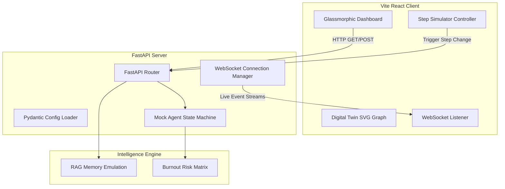

# 🤖 AI ScrumOS — Autonomous Engineering Operating System

> **An AI-native Engineering Operating System that autonomously manages software delivery workflows.**
> Developed by **[Ayushrak](https://github.com/Ayushrak)**

---

## 💡 What is AI ScrumOS?

Traditional project management tools (like Jira or Linear) are reactive: they require manual ticket updating, manual follow-ups, and developer overhead. Developers often hit roadblocks, push hotfixes, or get burnt out without explicitly logging a blocker.

**AI ScrumOS** is a futuristic, proactive **AI-native Engineering Operating System**. It continuously ingests real-time telemetry (Git activity, CI/CD telemetry, meeting transcriptions, and developer burnout indexes) to **predict delivery risks, map organization dependencies, autonomously coordinate blocker resolutions, and generate sprint retrospectives.**

---

## ⚡ The Problem & The ScrumOS Solution

### 1. The "Silent Blocker" Dilemma
* **Problem**: 70% of developer bottlenecks are never explicitly raised. Developers silently struggle with configuration errors or environment crashes.
* **ScrumOS Solution**: An **AI Observer** detects hidden blockers by analyzing behavioral signals (e.g., consecutive local build failures, repeated edits to Docker/config files, and lack of git pushes) to flag issues with a confidence index before it delays the sprint.

### 2. Complex System Dependency Chaos
* **Problem**: Microservice dependency graphs are complex. When a core API breaks, the cascading delay across team deliverables is hard to calculate.
* **ScrumOS Solution**: An **Engineering Digital Twin** maps services, owners, and active relations. When a node fails, risk levels pulsate and trace the cascading failure across critical delivery paths.

### 3. Metric Fatigue & Burnout
* **Problem**: Pure velocity metrics ignore human factors, leading to key developers burning out and resigning, carrying critical system memory away.
* **ScrumOS Solution**: 
  - **Team Wellness Optimizer**: Ethical, privacy-first context switching indexes and burnout calculators to balance work.
  - **Engineering Memory System**: A RAG-driven temporal knowledge terminal that indexes past architectural decisions (Slack conversations, Jira tickets, PRs) so historical context is preserved when developers transition.

---

## 🗺️ System Flow

The interactive hackathon simulator allows judges to advance a live software delivery cycle through **6 chronological steps**:

```
[Step 1: Developer Opens PR]
             ↓
[Step 2: CI/CD Pipeline Fails Repeatedly]
             ↓
[Step 3: AI Observer Detects Silent Blocker]
             ↓
[Step 4: Sprint Delay Risk Score Escalates (glows red)]
             ↓
[Step 5: AI Auto-Coordination Initiated (Slack/Jira alerts)]
             ↓
[Step 6: Blocker Resolved & Dashboard Risks Cleared]
```

---

## 🏗️ Architecture Design

AI ScrumOS is built on a decoupled **Client-Server Architecture** connecting a high-performance Python FastAPI server with a React + Vite dashboard.



---

## 📂 Project Directory Structure

```
e:/CODING/Generative_AI/Projects/AIScrumOS/
├── backend/
│   ├── .env                  # Active environmental variables
│   ├── .env.example          # Template configuration settings
│   ├── main.py               # FastAPI gateway & WebSocket manager
│   ├── mock_agents.py        # Core state machines, agents logic & mock DB
│   ├── config.py             # Pydantic Configuration loader
│   ├── requirements.txt      # Python dependencies
│   └── run.bat               # Windows execution batch script
├── src/
│   ├── components/
│   │   ├── DashboardOverview.jsx   # Live prediction dashboard
│   │   ├── DigitalTwinGraph.jsx    # Dependency mapping SVG graph
│   │   ├── SilentBlockers.jsx      # Behavioral build anomaly charts
│   │   ├── StandupMeetings.jsx     # Audio playback & transcribing sync
│   │   ├── MemorySystem.jsx        # RAG search citation terminal
│   │   ├── TechDebt.jsx            # Risk hotspots and bus factor
│   │   ├── TeamWellness.jsx        # Ethically audited burnout metrics
│   │   ├── RetroGenerator.jsx      # Autonomous sprint action plans
│   │   └── Sidebar.jsx             # Cyberpunk sidebar navigator
│   ├── App.jsx               # REST state syncing & WS listener
│   ├── index.css             # Neon custom styling layout
│   ├── main.jsx              # Vite entrypoint
│   └── mockData.js           # Client-side fallback database
├── .env                      # Vite active variables
├── .env.example              # Vite template variables
├── .gitignore                # Excludes secrets, pycaches, node_modules
├── package.json              # Frontend package manager
└── README.md                 # Hackathon documentation
```

---

## 🛠️ Installation & Setup

Ensure you have **Python 3** and **Node.js** installed on your system.

### 1. Clone & Configure Environments
Configure the environment variables using templates:
- Copy `/backend/.env.example` into `/backend/.env`
- Copy `/.env.example` into `/.env`

### 2. Start the Backend API Server
1. Navigate to the backend directory:
   ```powershell
   cd backend
   ```
2. Install Python dependencies:
   ```powershell
   pip install -r requirements.txt
   ```
3. Run the FastAPI development server:
   ```powershell
   python main.py
   ```
   *The server starts on `http://127.0.0.1:8000` with active code auto-reloading.*

### 3. Start the Frontend React Client
1. Open a new terminal in the project root:
   ```powershell
   cd ..
   ```
2. Install Node packages:
   ```powershell
   npm install
   ```
3. Start the Vite dev server:
   ```powershell
   npm run dev
   ```
   *Open `http://localhost:5173` in your browser to interact with the dashboard.*

---

## 🏆 Key Features Judges Love

* **Neumorphic & Cyberpunk Aesthetic**: Beautiful neon gradients, pulsing glows, glassmorphism design, and futuristic telemetry widgets that elevate it way beyond generic grid systems.
* **Decoupled WebSocket Broadcasting**: Advanced step changes in the simulator trigger real-time logs and updates instantly pushed from the Python server to all client instances via active WebSockets.
* **Instant Backend-to-Local Fallback**: If the FastAPI server is stopped, the client automatically falls back to full in-browser JS state simulation, ensuring zero presentation interruptions on stage!
